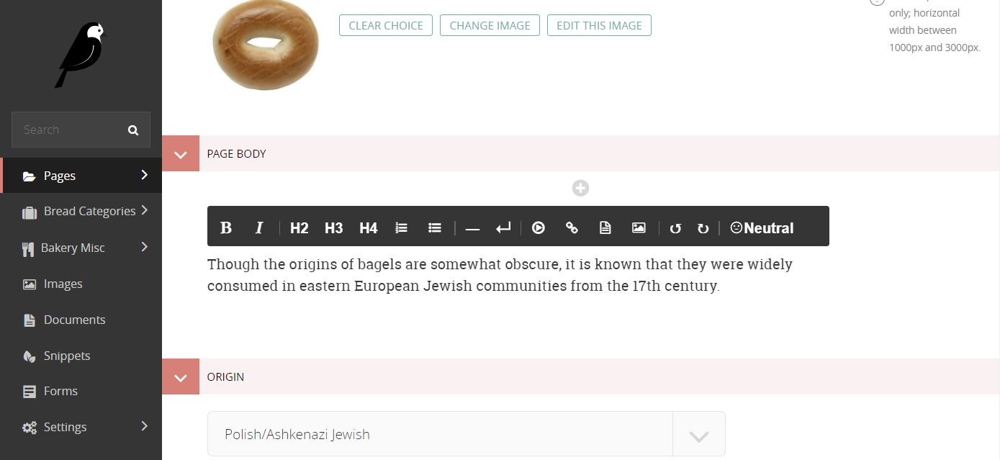

# wagtail-sentiment
A plugin for Wagtail draftail that applies sentiment analysis to text input into rich text fields.

!! This is an experimental build meant to test yet unreleased api features in Wagtail. It uses a monkeypatch to work with Wagtail 2.0 but may break in the future. !!



## Installation
- ```pip install wagtail-sentiment```
- Add ```wagtailsentiment``` to your list of installed apps AFTER all wagtail app includes (e.g. wagtail.admin, wagtail.core etc). 
  
## Usage  
Once installed You will see the sentiment calculation displayed in the toolbar of all rich text fields in your Wagtail admin area.
